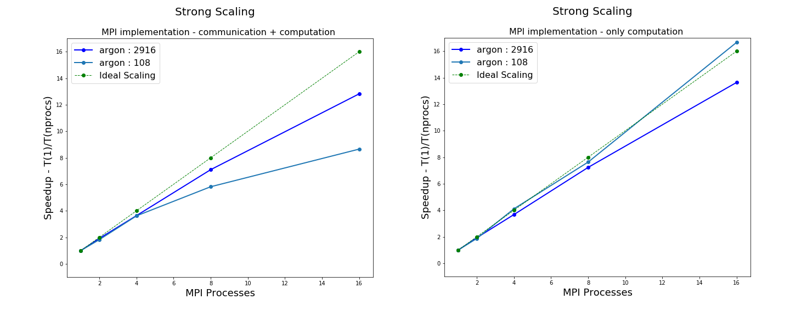

### contributors

- davydenk Irina Davydenkova : **python wrapper**
- ElenaDep Elena De Paoli : **openmp**
- NataNazar Natalia Nazarova : **code optimization**
- matteoalberti Matteo Alberti : **mpi**

This package contains simplified MD code with multi-threading
parallelization for simulating atoms with a Lennard-Jones potential.

### requirements:

python 3.6.5
openmpi version 3 or higher

###  Compiling and usage instructions: 

!!! always `make clean` before anything

#### to use python: 

 - `make shared` to create shared libraries for serial version 
 - `make shared_mpi` to create shared libraries for mpi version 
 - `make shared_openmp` to create shared libraries for openmp version 
 - `make shared_mpi_openmp` to create shared libraries for mixed version

 Then the go to the `examples` folder (or any subfolder where you place `.inp` files) and run `pytho3 ../ljmd.py < INPUT_FILE` to execute or `mpirun -np N pytho3 ../ljmd.py < INPUT_FILE` if you are using the `mpi` version

#### to use non-python version:

 - `make` -  will create the simplest possible executable (currently the default target)
 - `make mpi` -  the executable for shared_mpi
 - `make openmpi`  - the executable with `openmp` enabled
 - `make mpi_openmp` -  the executable with both `mpi` and `openmp` enabled

 Then go to the `examples` folder (or any subfolder where you place `.inp` files) and run `../ljmd.x < INPUT_FILE` to execute for non-mpi.

#### regression checks

!!! `make clean` before anything and `make ONE OF THE ABOVE OPTIONS` to create your libraries/executables 

  - `make check` to check python (after `make shared` or `make shared_openmp`)
  - `make mpi_check` to check python (after `make shared_mpi` or `make shared_mpi_openmp`)
  - `make check_c` to check c code (after `make` or `make openmp`)
  - `make mpi_check_c` to check c mpi code (after `make mpi` or `make mpi_openmp`)

--------------

## Reports

----------------------

### MPI Implementation

A complete report is available inside `/mpi_report` folder.

We want to report here just the **Strong Scaling** plots

--------------------------------

