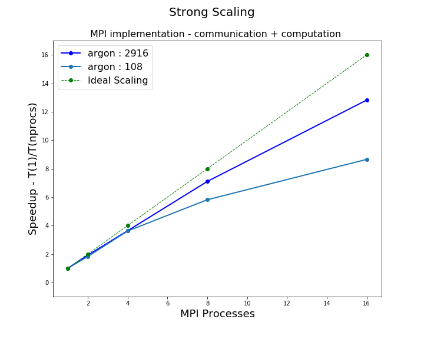
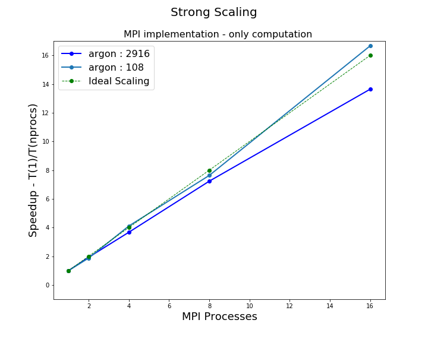

### Report on MPI implementation

------------------------

I tested the performance of MPI parallelization collecting timing from  `compute_force.c`  

After that I computed the **Strong Scaling**  (average about 10 runs / number of processors), the results are shown in the following plots, were we also show with a black dashed line the ideal linear scaling.

Strong Scaling give us good results

- at increasing data sizes the scaling improve considerably
- In a second step we should analyze how the communication part influence the global scaling

Anyhow, I decided to plot scaling considering only the computation part

